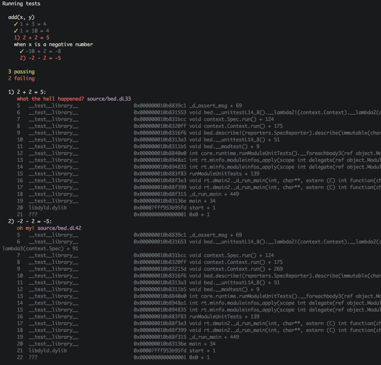

bed
===

- - -

**bed** is a BDD testing framework for D heavily inspired by TJ Holowaychuk's
Mocha (Node.js). It's still a WIP.

## Where I am at (approximately):

## LICENSE

This code is licensed under the MIT License. See [LICENSE](LICENSE) for more
information.
